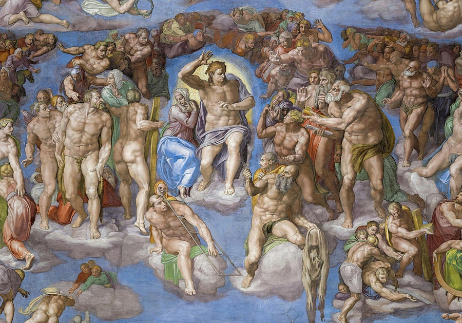
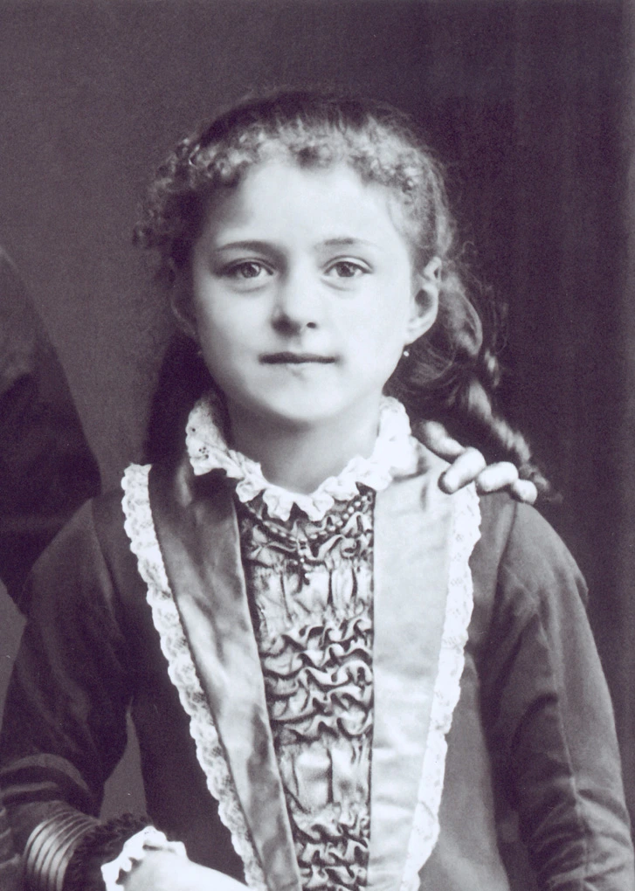

###  * Eu estou trabalhando por traduzir este artículo agora. Por favor, volta em breve! * 

> "Disse também esta parábola a uns que confiavam muito em si mesmos, como se fossem justos, e desprezavam os outros. Subiram dois homens ao templo a fazer oração: um era fariseu, outro publicano. O fariseu, de pé, orava no seu interior desta forma: Graças te dou, ó Deus, porque não sou como os outros homens: ladrões, injustos, adúlteros, nem como este publicano. Jejuo duas vezes na semana; pago o dízimo de tudo o que possuo, O publicano, porém, conservando-se a distância, não ousava nem ainda levantar os olhos ao céu, mas batia no peito, dizendo: Meu Deus, tem piedade de mim pecador. Digo-vos que este voltou justificado para sua casa, o outro não; porque quem se exalta será humilhado, e quem se humilha será exaltado."
Lucas 18:9-14

Este articúlo é uma carta aberta pra todos os católicos experienciando soberba espiritual.

Um católico experiencia soberba espiritual quando eles olham de cima de outros quem não são "espiritualmente limpo" como eles são. Talvez, ele ora alta antes de refeiçãoes, ou perturba outros orando ao cantando hinos nos lugares santos. 

Talvez, ele inclusive acha que o fé dele é um rebelião contra o mundo secular, escolhendo de ora barulhento perto dos quem não são religiosos, porque ele quise ser separados dos eles. Como um atheisto soberba usa o falta de fé dele por disturba christianos, o católico com soberba espiritualmente usa o fé dele pra pertuba o mundo secular. Como o fariseu, ele monstra por o mundo que *ele é mais perto de Deus* do que o resto.

## Mais santo que vós

Ele olha pra cima do outros quem queda mais longe do que ele. Talvez, ele refusa de falar com quem ele crê são ímpios. Como os 'pecaminoso' deles é uma mancha tão grande que eles terminaram de ser humanos quem Cristo nos chama pra amar. 
Infelizemente, o católico com soberba espiritualmente não sabe que inclusive quem vai pra igreja cada domingo talvez não iría o reino do céu. Um homem pio talvez queda no momento último dele. O pecadore pode ser salvado na respira ultíma dele. No día de nos julgamento, Cristo ia nos torna humilde. 

Quando Cristo disse por adúltero a "Nem eu te condeno; vai, e não peques mais." *(São João 8:11)*, ele ñao encontrou uma outra no nível dela e encoraja ela pra camina um caminho mais pio?  Cristo não condenou ela por o pecadore dela, ele chama ela por pio.
Santa Teresinha ora famousamente por o salvato de um matador triplo quem estava olhando uma senteza de morte vindo. No o momento ultímo dele, ele beijou um crucifixo tres vezes. Santa Teresinha estava cheia de joaia de tinha ouvido disso. Ele foi salvado.[^1]

Quando um católico com soberba espiritual torna de 'pessoas pecaminosas' com nojento, quantos [?] potencias ele está robando do Cristo? No lugar de tornando, ele deve olha pra quem ele crê são quedas, e ser uma raia do sol para eles segue do o escuro onde eles estão perdidos.

## Pio ensurdecedor

The spiritually prideful Catholic makes sure everyone around him knows that he prays. Instead of opting to quietly make the sign of the cross to express gratitude for the food in front of him, he deliberately jolts his hands across his body, making an obvious display of his faith for everyone around him to notice. He prays loudly, disrupting everyone around him.
He wants to set himself apart from the secular world, maybe he even intends to shock them as an act of defiance.

In holy sites, instead of praying silently, he may even sing hymns and interrupt the prayers of everyone else. He lectures fellow Catholics on how to live a life closer to God. "It's not good enough", he says, "to pray daily and go to mass!", making it obvious that he is more pious than all those around him. Even implying that he has secrets to godliness that even the practicing Catholics around him don't understand.

However, Christ repeatedly advises against these public demonstrations of prayer and faith.
> "Quando orais, não sejais como os hipócritas, que gostam de orar em pé nas sinagogas e nos cantos das praças, a fim de serem vistos pelos homens. Em verdade vos digo que já receberam a sua recompensa. Tu, porém, quando orares, entra no teu quarto, e, fechada a porta, ora a teu Pai em segredo; e teu Pai, que vê (o que se passa) em segredo, te dará a recompensa." São Mateus 6:5–6

Signing the cross and public prayer are not tools to shock non-christians, and they are not a pedestal to set oneself higher than other Catholics. Christ tells his followers to pray not as a performance but as a genuine act of communication with God.

## Mudando o caminho

Every Catholic must battle the inner Pharisee in them, and strive to be the publican who Christ exalts.

[^1]: Trent Horn, Why We're Catholic: Our Reasons for Faith, Hope, and Love (San Diego: Catholic Answers Press, 2017), p. 49.