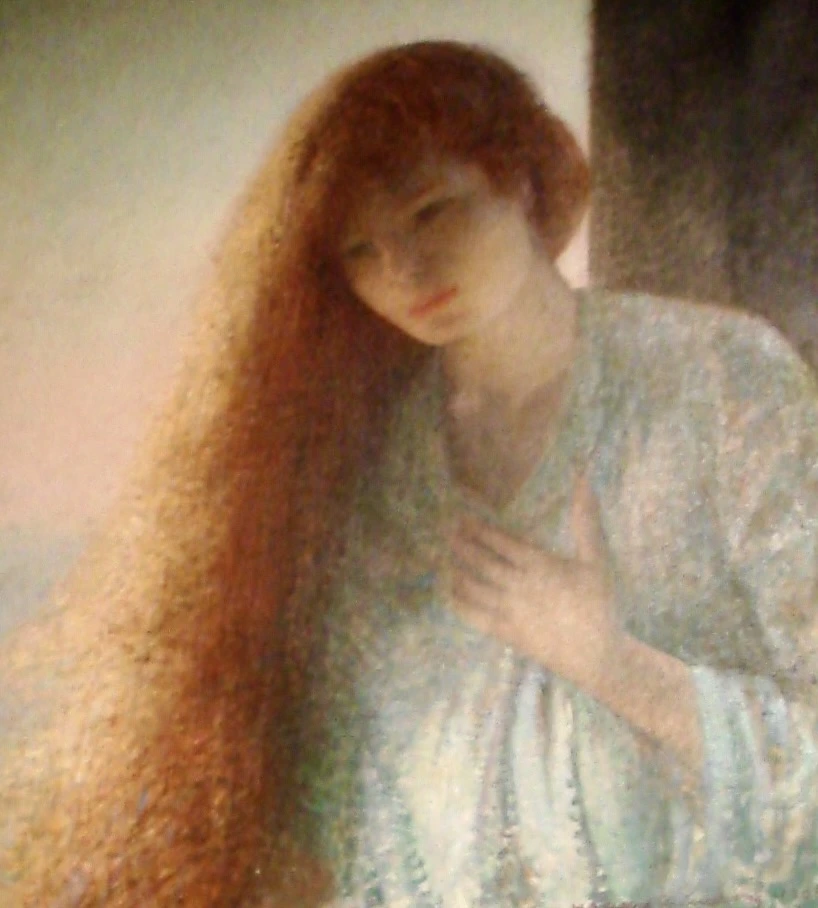
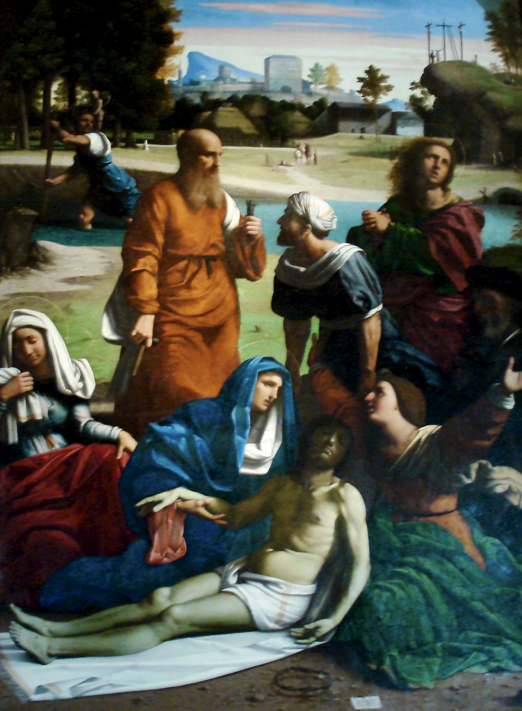
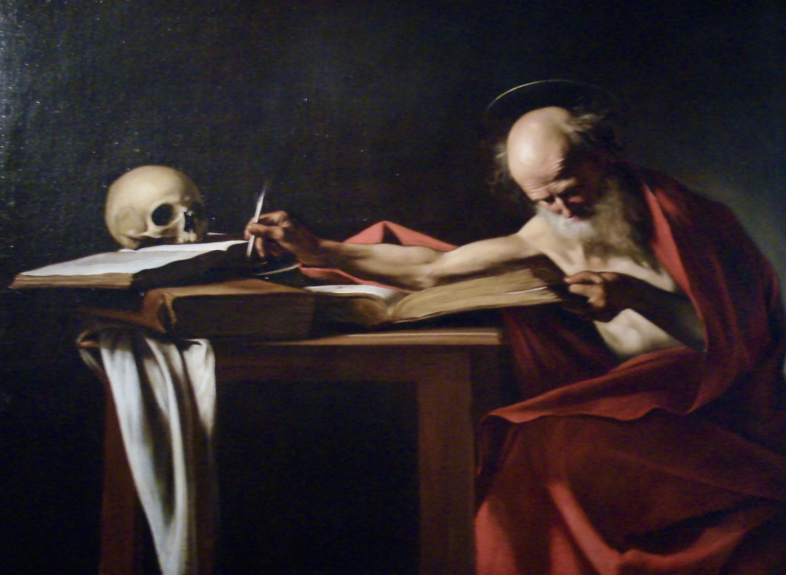

# FAQ
---
## Digital Minimalism
### Why don't you have a browser on your phone?

For the entirety of human history, nobody was able to be entertained at any moment with an endless amount of content in their pockets, nor were they able to answer any question that popped in their minds instantly. They didn't need it, and modern people don't need it either. It is a distraction from being present in the moment.

The only time I need to answer a question I have is either when I'm on my computer or at the library. When I'm out I want to focus on what I'm doing and the people I'm with. There is no reason that I would need access to an infinite amount of content and knowledge in my pocket anytime, and in any place. My life is considerably better with a dumber phone.

## Appearance
### How long have you been growing out your hair? 

People ask me this because I have long hair that ends at my hips. I started growing out my hair in 2019, inspired by my high school friend who had long, beautiful blonde hair.

### How did you grow your hair to be so long?

I avoid applying heat to my hair, so I never use a hairdryer or curling iron. I braid my hair every night before going to bed to avoid it getting matted. During winter time I try to always keep my hair braided, otherwise it would become matted from putting on and removing hats & jackets.

I also try to keep a good diet, which is very important for the health of my hair.

### When will you cut your hair?

I will grow out my hair for as long as it can stay healthy. If my ends are dead & thinning I will trim it. If I am able to grow my hair out to the floor and have it still be healthy, I will. 

### Why don't you pierce your ears?

I think body modifications like piercings are a distraction from the natural beauty of the human body. I have never gotten a piercing and I never will.

# Religion
## Why are you Catholic?

For many reasons, but I'll start off by saying why I'm not non-Catholic.

I'm not an atheist because I believe there is a God. I believe that there was once nothing and it was a greater power who created the Universe, the Earth, and eventually humans.

I'm not non-Christian because I believe that Jesus was fully man and fully God, and that his coming was prophesized in the Old Testament. I believe that he was born of a virgin, and was resurrected. 

I'm not Orthodox because I believe in the authority of the pope.

I'm not Protestant because I don't believe in 'Sola Scriptura'. I believe in the sacraments and the transubstantiation of the Eucharist. 

I'm not anything but Roman Catholic because I was baptized Roman Catholic, and it's how I was raised. It's what all my ancestors who came before me practiced, as far as I know.

I want to clarify that I respect all people regardless of their religious beliefs, and I would not be offended if someone disagreed with me. I only want to state why I'm Roman Catholic, for the reasons I listed above.

# Notes
---
## About The Site
### Translations

All translations on this site are written by me. I included this feature onto my website because one of my hobbies is language learning. I believe writing in my target language will help me improve. Another reason why I included translations on this site is because I have many friends and family in other countries and I want them to be able to read my words directly in their mother tongue.

I don't use google translate or AI for any of my translations. It would completely defeat the purpose of including translations on my website in the first place. 

When writing translations in Portuguese, I try to write what I am able to come up with on my own without a dictionary. When needed, I will use [WordReference](https://www.wordreference.com/)  or [Reverso Contexto](https://context.reverso.net/translation/) to look up specific words, expressions or conjugations I'm struggling to come up with on my own. Once my translation is written and published, I will make further corrections if needed after being given feedback by my friends and family. Because of my intentionality with my translations, the process is slow. Not every page or article can be translated right away.

I have future plans to add Spanish and Italian translations onto my site. 

*A special thanks to Gabriel of Paraná for proofreading the Portuguese translations on my website.* ଘ (੭ˊᴗˋ)੭* 

### AI transparency 
Some parts of this website have been programmed with the assistance of AI. I have utilized AI on some photographs of my artwork in order to edit out shadows or any other artifacts resulting from photographing it. The purpose of doing this is to make it look as close to the original as possible. 

Aside from this, all words, articles, and ideas on this website are solely written by me without the assistance of AI in proofreading or brainstorming. I do not use AI in any other process of my paintings or drawings aside from what I've already mentioned, not for the design, composition, sketch, reference or choice of colors. Any photograph of a thing, person or place taken by me has not been altered in any way by the use of AI. All translations on this site have been written by me without the help of AI.
